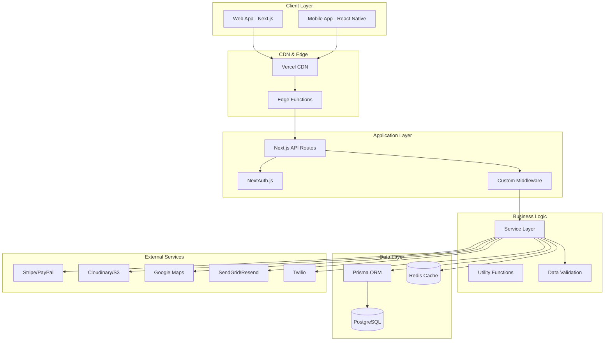

# 🏗️ Technical Architecture - Enterprise Airbnb Clone

## Overview

This document outlines the technical architecture of our enterprise-grade Airbnb clone, built with modern technologies and following industry best practices for scalability, security, and maintainability.

## 📊 System Architecture Diagram



## 🔧 Technology Stack

### Frontend
- **Next.js 15**: React framework with App Router and Server Components
- **TypeScript 5.0**: Type-safe development with latest features
- **TailwindCSS 4.0**: Utility-first CSS framework with custom design system
- **React Hook Form**: Performant forms with built-in validation
- **Zustand**: Lightweight state management for client-side data
- **React Icons**: Comprehensive icon library

### Backend
- **Next.js API Routes**: Serverless API endpoints with type safety
- **NextAuth.js**: Authentication with multiple providers
- **Prisma ORM**: Type-safe database operations with PostgreSQL
- **bcrypt**: Password hashing and security
- **Zod**: Runtime type validation and parsing

### Database
- **PostgreSQL**: Primary relational database
- **Redis**: Caching and session storage
- **Prisma**: ORM with migrations and type generation

### Infrastructure
- **Vercel**: Deployment platform with edge functions
- **Cloudinary**: Image and video management
- **Stripe**: Payment processing
- **SendGrid**: Email delivery service
- **Google Maps**: Location services and mapping

## 🗄️ Database Schema

### Core Entities

```prisma
model User {
  id                String   @id @default(cuid())
  email             String   @unique
  name              String?
  image             String?
  emailVerified     DateTime?
  hashedPassword    String?
  favoriteIds       String[]
  createdAt         DateTime @default(now())
  updatedAt         DateTime @updatedAt
  
  accounts          Account[]
  listings          Listing[]
  reservations      Reservation[]
  reviews           Review[]
  
  @@map("users")
}

model Account {
  id                String  @id @default(cuid())
  userId            String
  type              String
  provider          String
  providerAccountId String
  refresh_token     String?
  access_token      String?
  expires_at        Int?
  token_type        String?
  scope             String?
  id_token          String?
  session_state     String?
  
  user User @relation(fields: [userId], references: [id], onDelete: Cascade)
  
  @@unique([provider, providerAccountId])
  @@map("accounts")
}

model Listing {
  id              String   @id @default(cuid())
  title           String
  description     String
  imageSrc        String[]
  category        String
  roomCount       Int
  bathroomCount   Int
  guestCount      Int
  locationValue   String
  price           Int
  userId          String
  createdAt       DateTime @default(now())
  updatedAt       DateTime @updatedAt
  
  user         User          @relation(fields: [userId], references: [id], onDelete: Cascade)
  reservations Reservation[]
  reviews      Review[]
  amenities    Amenity[]
  
  @@map("listings")
}

model Reservation {
  id         String   @id @default(cuid())
  userId     String
  listingId  String
  startDate  DateTime
  endDate    DateTime
  totalPrice Int
  status     ReservationStatus @default(PENDING)
  createdAt  DateTime @default(now())
  updatedAt  DateTime @updatedAt
  
  user    User    @relation(fields: [userId], references: [id], onDelete: Cascade)
  listing Listing @relation(fields: [listingId], references: [id], onDelete: Cascade)
  payment Payment?
  
  @@map("reservations")
}

model Review {
  id        String   @id @default(cuid())
  rating    Int
  comment   String?
  userId    String
  listingId String
  createdAt DateTime @default(now())
  updatedAt DateTime @updatedAt
  
  user    User    @relation(fields: [userId], references: [id], onDelete: Cascade)
  listing Listing @relation(fields: [listingId], references: [id], onDelete: Cascade)
  
  @@unique([userId, listingId])
  @@map("reviews")
}

model Amenity {
  id        String    @id @default(cuid())
  name      String    @unique
  icon      String
  category  String
  listings  Listing[]
  
  @@map("amenities")
}

model Payment {
  id            String            @id @default(cuid())
  reservationId String            @unique
  amount        Int
  currency      String            @default("usd")
  status        PaymentStatus     @default(PENDING)
  stripeId      String?
  paypalId      String?
  method        PaymentMethod
  createdAt     DateTime          @default(now())
  updatedAt     DateTime          @updatedAt
  
  reservation Reservation @relation(fields: [reservationId], references: [id], onDelete: Cascade)
  
  @@map("payments")
}

enum ReservationStatus {
  PENDING
  CONFIRMED
  CANCELLED
  COMPLETED
}

enum PaymentStatus {
  PENDING
  COMPLETED
  FAILED
  REFUNDED
}

enum PaymentMethod {
  STRIPE
  PAYPAL
  APPLE_PAY
  GOOGLE_PAY
}
```

### Database Indexes

```sql
-- Performance indexes
CREATE INDEX idx_listings_category ON listings(category);
CREATE INDEX idx_listings_location ON listings(locationValue);
CREATE INDEX idx_listings_price ON listings(price);
CREATE INDEX idx_listings_user ON listings(userId);
CREATE INDEX idx_reservations_dates ON reservations(startDate, endDate);
CREATE INDEX idx_reservations_status ON reservations(status);
CREATE INDEX idx_reviews_listing ON reviews(listingId);
CREATE INDEX idx_users_email ON users(email);

-- Composite indexes for common queries
CREATE INDEX idx_listings_category_price ON listings(category, price);
CREATE INDEX idx_reservations_user_status ON reservations(userId, status);
```

## 🔐 Authentication & Authorization

### Authentication Flow

```typescript
// Authentication service
export class AuthService {
  static async signUp(credentials: SignUpCredentials) {
    // Validate input
    const validatedData = signUpSchema.parse(credentials);
    
    // Check if user exists
    const existingUser = await prisma.user.findUnique({
      where: { email: validatedData.email }
    });
    
    if (existingUser) {
      throw new Error('User already exists');
    }
    
    // Hash password
    const hashedPassword = await bcrypt.hash(validatedData.password, 12);
    
    // Create user
    const user = await prisma.user.create({
      data: {
        email: validatedData.email,
        name: validatedData.name,
        hashedPassword
      }
    });
    
    // Send verification email
    await EmailService.sendVerificationEmail(user);
    
    return user;
  }
  
  static async signIn(credentials: SignInCredentials) {
    // Validate and authenticate user
    // Return JWT token or session
  }
}
```

### Authorization Middleware

```typescript
// Middleware for protected routes
export function withAuth(handler: NextApiHandler) {
  return async (req: NextApiRequest, res: NextApiResponse) => {
    const session = await getServerSession(req, res, authOptions);
    
    if (!session) {
      return res.status(401).json({ error: 'Unauthorized' });
    }
    
    // Add user to request
    (req as any).user = session.user;
    
    return handler(req, res);
  };
}

// Role-based authorization
export function withRole(roles: string[]) {
  return function(handler: NextApiHandler) {
    return async (req: NextApiRequest, res: NextApiResponse) => {
      const user = (req as any).user;
      
      if (!user || !roles.includes(user.role)) {
        return res.status(403).json({ error: 'Forbidden' });
      }
      
      return handler(req, res);
    };
  };
}
```

## 📡 API Architecture

### RESTful API Design

```typescript
// API route structure
/api/
├── auth/
│   ├── register/          # POST - User registration
│   ├── login/            # POST - User login
│   ├── logout/           # POST - User logout
│   └── verify/           # POST - Email verification
├── users/
│   ├── route.ts          # GET, PUT - User CRUD
│   ├── [id]/
│   │   └── route.ts      # GET, PUT, DELETE - Specific user
│   └── profile/
│       └── route.ts      # GET, PUT - User profile
├── listings/
│   ├── route.ts          # GET, POST - Listings CRUD
│   ├── [id]/
│   │   ├── route.ts      # GET, PUT, DELETE - Specific listing
│   │   ├── reviews/      # GET, POST - Listing reviews
│   │   └── availability/ # GET - Check availability
│   ├── search/           # GET - Search listings
│   └── favorites/        # GET, POST, DELETE - User favorites
├── reservations/
│   ├── route.ts          # GET, POST - Reservations CRUD
│   ├── [id]/
│   │   ├── route.ts      # GET, PUT, DELETE - Specific reservation
│   │   ├── cancel/       # POST - Cancel reservation
│   │   └── confirm/      # POST - Confirm reservation
│   └── calendar/         # GET - Calendar availability
├── payments/
│   ├── create-intent/    # POST - Create payment intent
│   ├── confirm/          # POST - Confirm payment
│   ├── webhook/          # POST - Payment webhook
│   └── refund/           # POST - Process refund
└── upload/
    ├── images/           # POST - Upload property images
    └── documents/        # POST - Upload documents
```

### API Response Format

```typescript
// Standardized API response
interface ApiResponse<T = any> {
  success: boolean;
  data?: T;
  error?: string;
  message?: string;
  meta?: {
    page?: number;
    limit?: number;
    total?: number;
    totalPages?: number;
  };
}

// Success response
export function successResponse<T>(
  data: T,
  message?: string,
  meta?: any
): ApiResponse<T> {
  return {
    success: true,
    data,
    message,
    meta
  };
}

// Error response
export function errorResponse(
  error: string,
  statusCode: number = 400
): Response {
  return NextResponse.json(
    { success: false, error },
    { status: statusCode }
  );
}
```

## 🔄 State Management

### Client-Side State (Zustand)

```typescript
// Global state management
interface AppState {
  // User state
  user: User | null;
  isAuthenticated: boolean;
  
  // UI state
  isLoginModalOpen: boolean;
  isRegisterModalOpen: boolean;
  searchFilters: SearchFilters;
  
  // Data state
  listings: Listing[];
  favorites: string[];
  reservations: Reservation[];
}

interface AppActions {
  // User actions
  setUser: (user: User | null) => void;
  login: (credentials: LoginCredentials) => Promise<void>;
  logout: () => void;
  
  // UI actions
  openLoginModal: () => void;
  closeLoginModal: () => void;
  setSearchFilters: (filters: SearchFilters) => void;
  
  // Data actions
  setListings: (listings: Listing[]) => void;
  addToFavorites: (listingId: string) => void;
  removeFromFavorites: (listingId: string) => void;
}

export const useAppStore = create<AppState & AppActions>((set, get) => ({
  // Initial state
  user: null,
  isAuthenticated: false,
  isLoginModalOpen: false,
  isRegisterModalOpen: false,
  searchFilters: {},
  listings: [],
  favorites: [],
  reservations: [],
  
  // Actions
  setUser: (user) => set({ user, isAuthenticated: !!user }),
  
  login: async (credentials) => {
    try {
      const response = await fetch('/api/auth/login', {
        method: 'POST',
        headers: { 'Content-Type': 'application/json' },
        body: JSON.stringify(credentials)
      });
      
      if (response.ok) {
        const { user } = await response.json();
        set({ user, isAuthenticated: true, isLoginModalOpen: false });
      }
    } catch (error) {
      console.error('Login failed:', error);
    }
  },
  
  // ... other actions
}));
```

### Server-Side State (React Query)

```typescript
// Data fetching hooks
export function useListings(filters?: SearchFilters) {
  return useQuery({
    queryKey: ['listings', filters],
    queryFn: () => fetchListings(filters),
    staleTime: 5 * 60 * 1000, // 5 minutes
  });
}

export function useListing(id: string) {
  return useQuery({
    queryKey: ['listing', id],
    queryFn: () => fetchListing(id),
    enabled: !!id,
  });
}

export function useCreateReservation() {
  const queryClient = useQueryClient();
  
  return useMutation({
    mutationFn: createReservation,
    onSuccess: () => {
      queryClient.invalidateQueries({ queryKey: ['reservations'] });
    },
  });
}
```

## 🎨 UI Architecture

### Component Structure

```
src/app/components/
├── ui/                   # Base UI components
│   ├── Button.tsx
│   ├── Input.tsx
│   ├── Modal.tsx
│   ├── Card.tsx
│   └── index.ts
├── forms/               # Form components
│   ├── LoginForm.tsx
│   ├── RegisterForm.tsx
│   ├── ListingForm.tsx
│   └── SearchForm.tsx
├── layout/              # Layout components
│   ├── Header.tsx
│   ├── Footer.tsx
│   ├── Sidebar.tsx
│   └── Navigation.tsx
├── features/            # Feature-specific components
│   ├── auth/
│   ├── listings/
│   ├── reservations/
│   └── profile/
└── providers/           # Context providers
    ├── AuthProvider.tsx
    ├── ThemeProvider.tsx
    └── QueryProvider.tsx
```

### Design System

```typescript
// Design tokens
export const theme = {
  colors: {
    primary: {
      50: '#fef2f2',
      500: '#ef4444',
      900: '#7f1d1d',
    },
    neutral: {
      50: '#f9fafb',
      500: '#6b7280',
      900: '#111827',
    },
  },
  spacing: {
    xs: '0.5rem',
    sm: '1rem',
    md: '1.5rem',
    lg: '2rem',
    xl: '3rem',
  },
  typography: {
    fontFamily: {
      sans: ['Inter', 'sans-serif'],
      serif: ['Merriweather', 'serif'],
    },
    fontSize: {
      xs: '0.75rem',
      sm: '0.875rem',
      base: '1rem',
      lg: '1.125rem',
      xl: '1.25rem',
    },
  },
};

// Component variants
export const buttonVariants = {
  variant: {
    primary: 'bg-primary-500 text-white hover:bg-primary-600',
    secondary: 'bg-neutral-100 text-neutral-900 hover:bg-neutral-200',
    outline: 'border border-neutral-300 text-neutral-700 hover:bg-neutral-50',
  },
  size: {
    sm: 'px-3 py-1.5 text-sm',
    md: 'px-4 py-2 text-base',
    lg: 'px-6 py-3 text-lg',
  },
};
```

## 📊 Performance Optimization

### Frontend Performance

```typescript
// Code splitting
const ListingModal = lazy(() => import('./ListingModal'));
const UserProfile = lazy(() => import('./UserProfile'));

// Image optimization
import Image from 'next/image';

const PropertyImage = ({ src, alt }: { src: string; alt: string }) => (
  <Image
    src={src}
    alt={alt}
    width={400}
    height={300}
    priority={false}
    placeholder="blur"
    blurDataURL="data:image/jpeg;base64,/9j/4AAQSkZJRgABAQAAAQ..."
  />
);

// Memoization
const ExpensiveComponent = memo(({ data }: { data: ComplexData }) => {
  const processedData = useMemo(
    () => processComplexData(data),
    [data]
  );
  
  return <div>{processedData}</div>;
});
```

### Backend Performance

```typescript
// Database query optimization
export async function getListingsWithFilters(filters: SearchFilters) {
  const { category, location, priceRange, amenities } = filters;
  
  return await prisma.listing.findMany({
    where: {
      ...(category && { category }),
      ...(location && { locationValue: location }),
      ...(priceRange && {
        price: {
          gte: priceRange.min,
          lte: priceRange.max,
        },
      }),
      ...(amenities && {
        amenities: {
          some: {
            id: { in: amenities },
          },
        },
      }),
    },
    include: {
      user: {
        select: { id: true, name: true, image: true },
      },
      reviews: {
        select: { rating: true },
      },
      _count: {
        select: { reviews: true },
      },
    },
    orderBy: { createdAt: 'desc' },
    take: 20,
    skip: filters.page ? (filters.page - 1) * 20 : 0,
  });
}

// Caching strategy
import { Redis } from 'ioredis';

const redis = new Redis(process.env.REDIS_URL);

export async function getCachedListings(key: string) {
  const cached = await redis.get(key);
  if (cached) {
    return JSON.parse(cached);
  }
  
  const data = await getListingsFromDatabase();
  await redis.setex(key, 300, JSON.stringify(data)); // 5 minutes
  
  return data;
}
```

## 🔒 Security Implementation

### Input Validation

```typescript
import { z } from 'zod';

// Schema definitions
export const createListingSchema = z.object({
  title: z.string().min(1).max(100),
  description: z.string().min(10).max(1000),
  category: z.enum(['house', 'apartment', 'hotel', 'unique']),
  roomCount: z.number().int().min(1).max(20),
  bathroomCount: z.number().int().min(1).max(10),
  guestCount: z.number().int().min(1).max(50),
  locationValue: z.string().min(1),
  price: z.number().int().min(1).max(10000),
  imageSrc: z.array(z.string().url()).min(1).max(10),
  amenities: z.array(z.string().cuid()).optional(),
});

// Validation middleware
export function validateRequest<T>(schema: z.ZodSchema<T>) {
  return async (req: NextRequest) => {
    try {
      const body = await req.json();
      const validatedData = schema.parse(body);
      return { success: true, data: validatedData };
    } catch (error) {
      if (error instanceof z.ZodError) {
        return {
          success: false,
          error: 'Validation failed',
          details: error.errors,
        };
      }
      return { success: false, error: 'Invalid request' };
    }
  };
}
```

### Rate Limiting

```typescript
import { Ratelimit } from '@upstash/ratelimit';
import { Redis } from '@upstash/redis';

// Rate limiting configuration
const ratelimit = new Ratelimit({
  redis: Redis.fromEnv(),
  limiter: Ratelimit.slidingWindow(10, '10 s'),
});

export async function withRateLimit(
  request: NextRequest,
  identifier: string
) {
  const { success, limit, reset, remaining } = await ratelimit.limit(
    identifier
  );
  
  if (!success) {
    return new Response('Too Many Requests', {
      status: 429,
      headers: {
        'X-RateLimit-Limit': limit.toString(),
        'X-RateLimit-Remaining': remaining.toString(),
        'X-RateLimit-Reset': new Date(reset).toISOString(),
      },
    });
  }
  
  return null; // Allow request to proceed
}
```

## 🚀 Deployment Architecture

### Vercel Deployment

```typescript
// vercel.json
{
  "functions": {
    "src/app/api/**/*.ts": {
      "maxDuration": 30
    }
  },
  "regions": ["iad1", "sfo1", "lhr1"],
  "env": {
    "DATABASE_URL": "@database-url",
    "NEXTAUTH_SECRET": "@nextauth-secret"
  },
  "build": {
    "env": {
      "SKIP_ENV_VALIDATION": "1"
    }
  }
}

// next.config.js
/** @type {import('next').NextConfig} */
const nextConfig = {
  experimental: {
    serverComponentsExternalPackages: ['@prisma/client'],
  },
  images: {
    domains: ['res.cloudinary.com', 'lh3.googleusercontent.com'],
  },
  env: {
    CUSTOM_KEY: process.env.CUSTOM_KEY,
  },
};

module.exports = nextConfig;
```

### Database Deployment

```sql
-- Production database setup
-- Connection pooling
SET max_connections = 200;
SET shared_buffers = '256MB';
SET effective_cache_size = '1GB';

-- Monitoring queries
CREATE EXTENSION IF NOT EXISTS pg_stat_statements;

-- Backup strategy
-- Daily automated backups with 30-day retention
-- Point-in-time recovery enabled
```

## 📊 Monitoring & Analytics

### Application Monitoring

```typescript
// Error tracking with Sentry
import * as Sentry from '@sentry/nextjs';

Sentry.init({
  dsn: process.env.SENTRY_DSN,
  environment: process.env.NODE_ENV,
  tracesSampleRate: 1.0,
});

// Performance monitoring
export function trackPerformance(name: string, fn: Function) {
  return Sentry.startTransaction({ name }, async (transaction) => {
    try {
      const result = await fn();
      transaction.setStatus('ok');
      return result;
    } catch (error) {
      transaction.setStatus('internal_error');
      Sentry.captureException(error);
      throw error;
    } finally {
      transaction.finish();
    }
  });
}

// Business metrics tracking
export class Analytics {
  static trackListingView(listingId: string, userId?: string) {
    // Track listing views for recommendations
  }
  
  static trackBookingAttempt(listingId: string, userId: string) {
    // Track booking funnel metrics
  }
  
  static trackSearchQuery(query: SearchFilters) {
    // Track search patterns for optimization
  }
}
```

## 🔄 CI/CD Pipeline

### GitHub Actions

```yaml
# .github/workflows/ci.yml
name: CI/CD Pipeline

on:
  push:
    branches: [main, develop]
  pull_request:
    branches: [main]

jobs:
  test:
    runs-on: ubuntu-latest
    steps:
      - uses: actions/checkout@v3
      - uses: actions/setup-node@v3
        with:
          node-version: '18'
          cache: 'npm'
      
      - run: npm ci
      - run: npm run lint
      - run: npm run type-check
      - run: npm run test
      - run: npm run build
  
  deploy:
    needs: test
    runs-on: ubuntu-latest
    if: github.ref == 'refs/heads/main'
    steps:
      - uses: actions/checkout@v3
      - uses: amondnet/vercel-action@v20
        with:
          vercel-token: ${{ secrets.VERCEL_TOKEN }}
          vercel-org-id: ${{ secrets.VERCEL_ORG_ID }}
          vercel-project-id: ${{ secrets.VERCEL_PROJECT_ID }}
          vercel-args: '--prod'
```

This architecture document provides a comprehensive overview of the technical implementation, ensuring scalability, maintainability, and performance for the enterprise Airbnb clone.
